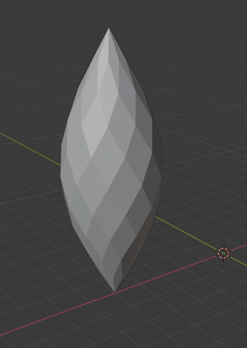
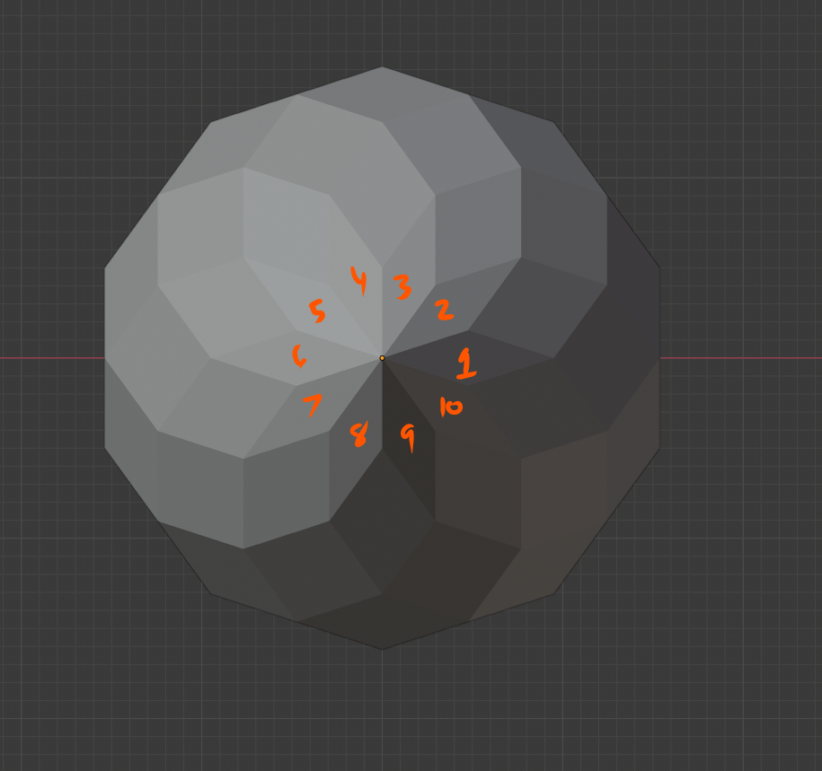
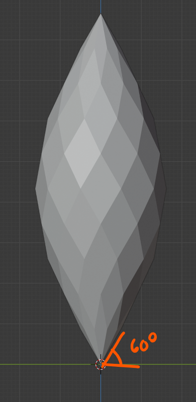
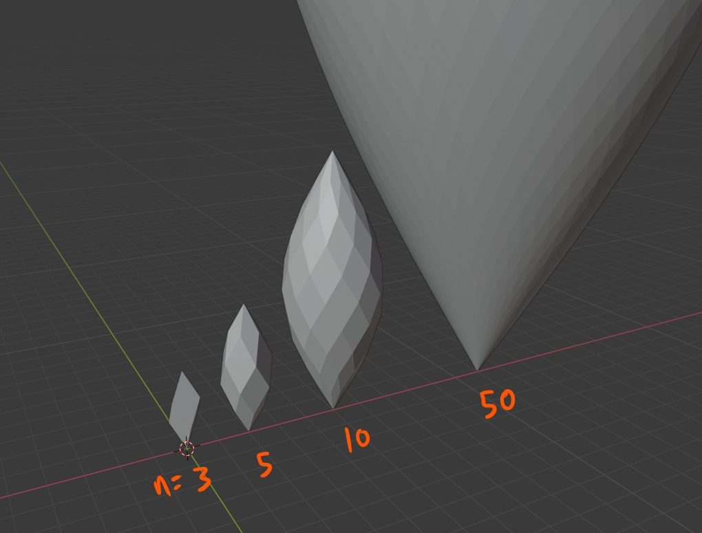
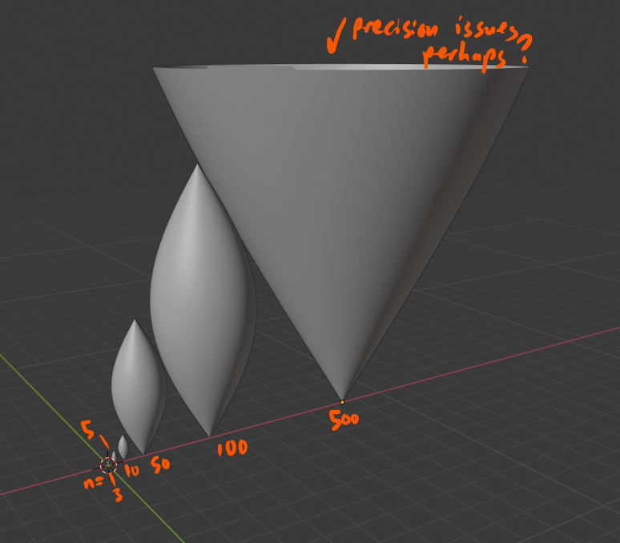

# Polar Zonohedra (2021)

Just a simple script to generate an OBJ mesh of a polar zonohedron

## Dependencies

The dependencies are installed the usual way with `pip`

```bash
pip install -r requirements.txt
```

## Usage

```bash
python main.py vector_count pitch_angle_degrees
```

For example,

```bash
python main.py 10 60
```

creates the `models/polar_zonohedron.obj` with 10-fold symmetry and where the
edges that are connected to the origin are at 60 degrees to the horizontal

| Example Output | Top View | Side view |
|---|---|---|
| |  |  |

## Background

A month or two ago, I first learned about polar zonohedra from the 2021
Bridges Math Art Conference paper ["The Joy of Polar Zonohedra"](http://archive.bridgesmathart.org/2021/bridges2021-7.pdf) by George Hart.

I found this shape quite elegant, as it is constructed from simple rules:

1. take `n` evenly spaced "generator" vectors arranged in a cone with the tails at the origin. The pitch angle is the elevation of these vectors from the horizontal.
2. Add adjacent vectors with vector addition, creating a new layer of vertices.
3. Keep repeating the process layer by layer. Eventually all the vectors will converge at a single point (the sum of all `n` generators)

The end result is a shape with `n`-fold rotational symmetry along the major axis, and a length of `n * sin(pitch_angle)`

## Limiting Behavior

One question I wanted to explore is "what shape do you get as `n` increases?" So I generated some meshes at various values of `n` to see what happens. Some observations:

1. for small `n`, the shape looks like a spiral-shaped crystal
2. as `n` gets into the range of 10s to 100s of vectors, it smoothes out considerably. It seems to approach a [lemon](https://mathworld.wolfram.com/Lemon.html) surface (a lens revolved around its major axis), or something quite similar.
3. This script seems to break down around `n = 500`, not sure if it's precision issues or something that's specific to OpenMesh.
4. As `n` gets larger, the angle between adjacent generators approaches 0. The spacing between levels of vertices is always constant, so I think this means the shape approaches an infinite cone?
5. Since the shape is increasing in size without bound, the top point approaches infinity.
6. However, the halfway point is also approaching infinity...
7. I'm guessing the answer is the limiting shape isn't defined since there's divergence here. But conceptually I feel like the infinite cone makes the most sense - it's like a lemon so ludicrously large that you can never even reach the halfway point in finite time if you start walking along the surface starting at the origin.

| Small values of `n` | Larger values of `n` |
|---|---|
|  | |